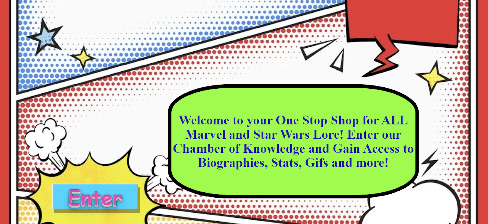
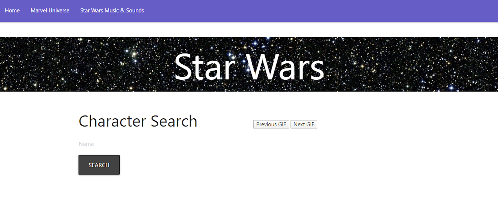
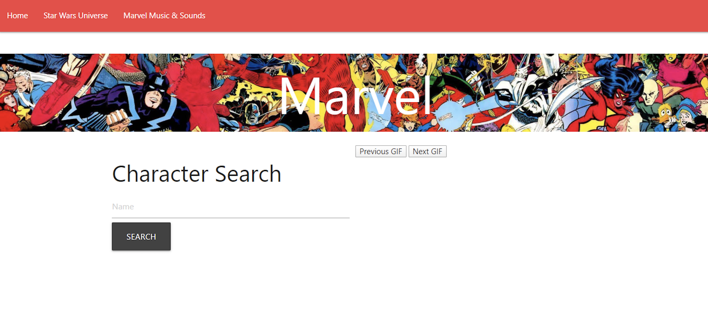
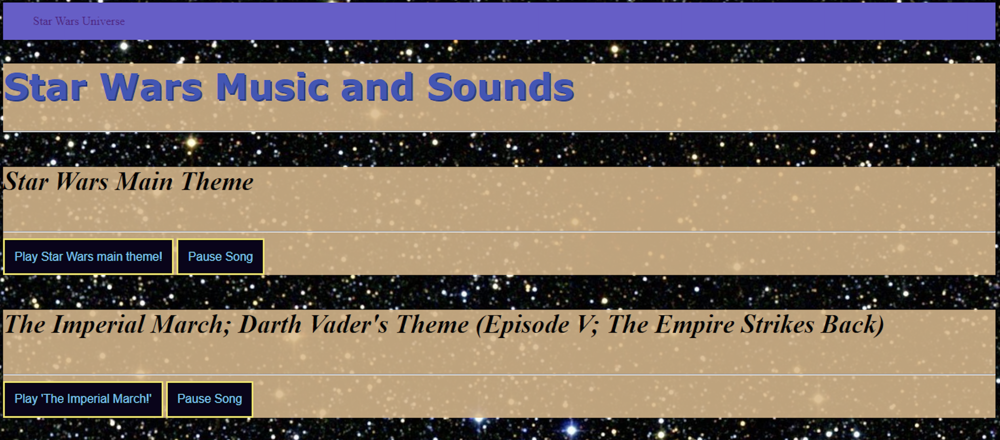
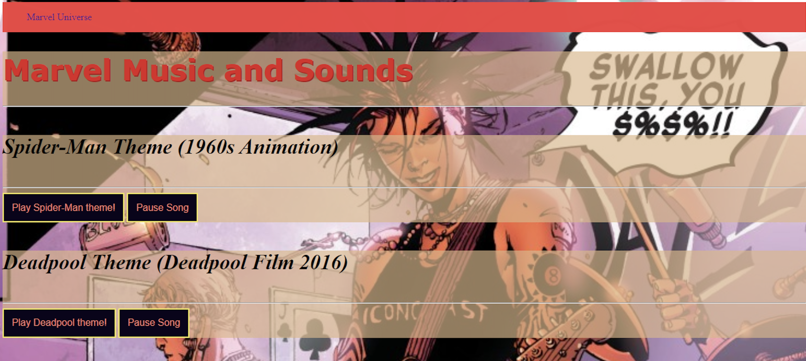

Overview
Welcome to Project 1! This is an important step in our full-stack journey as we will now use our newly acquired skills and knowledge to build web application from scratch. With our team, we will conceive and execute a design that solves a real-world problem by integrating data received from multiple server-side API requests. Because we will be working collaboratively, we will learn agile development methodologies and implement feature and bug fixes using the git branch workflow and pull requests.

Concept
We wanted to create an app that can provide some fun facts about different characters from different universes. We implemented giphys, theme songs and sound bites from our favorite scenes! This app can be expanded by incorporating more APIs to generate facts about other universes heros like Lord of the Rings. 

What is this and who is it for?  

This is an application that provides Star Wars and Marvel information and entertainment. A user can search a character to be provided their information and statistics.

A Star Wars and Marvel Website  

Live application link: https://pagelhunt.github.io/Project1/ 

Directions:  
1. Enter site  
  

2. Choose a Star Wars or Marvel category  
  

3. Search a character  
  
  

4. Interact with category related GIFs  
4. Navigate to sound page  
  

  

5. Play category related sound bites  

Features  
Mobile-first UI Design  
CSS Materialize Framework  
Third Party and Server Side API functionality 
Theme Songs
Sound Bites
Custom Images

Authors  
Carina Manent  
Indigo Violet  
Page Hunt  
Ilana Shaffer  
